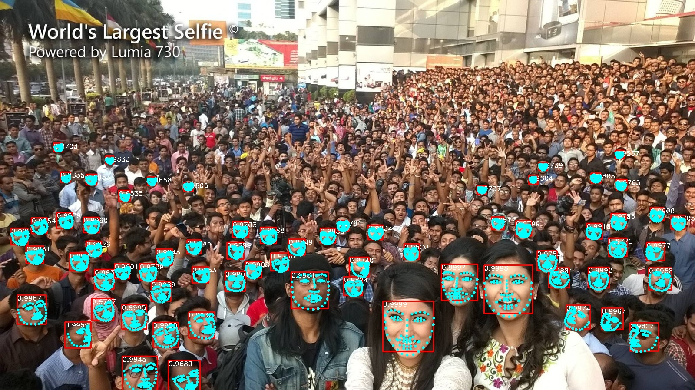
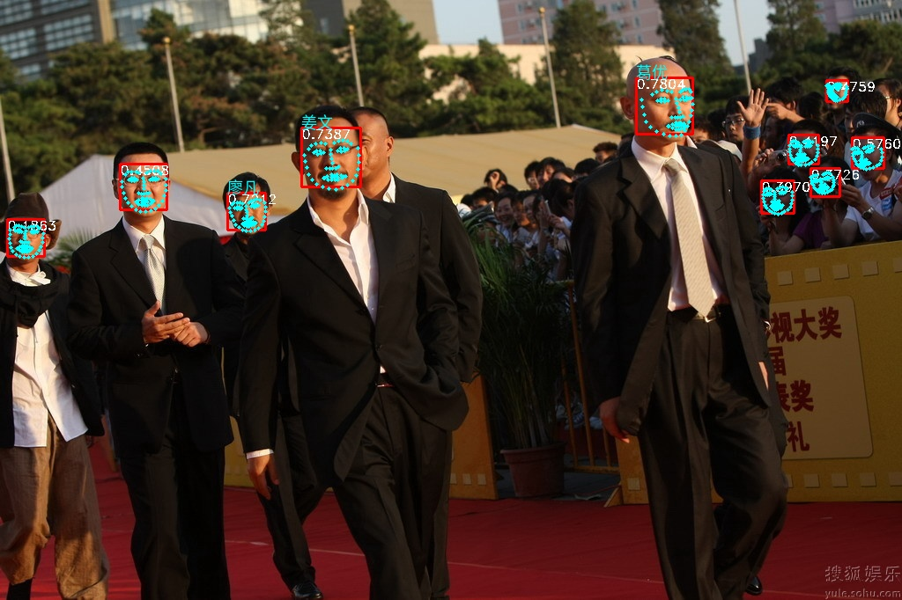

English | [中文](README_zh.md)
# OpenIVA
OpenIVA is an end-to-end intelligent video analytics development toolkit based on different inference backends, designed to help individual users and start-ups quickly launch their own video AI services.  
OpenIVA implements varied mainstream facial recognition, object detection, segmentation and landmark detection algorithms. And it provides an efficient and lightweight service deployment framework with a modular design. Users only need to replace the algorithm model used for their own tasks.
# Features
1. Common mainstream algorithms
- Provides latest fast accurate pre-trained models for facial recognition, object detection, segmentation and landmark detection tasks
2. Multi inference backends
- Supports TensorlayerX/ TensorRT/ onnxruntime
3. High performance  
- Achieves high performance on CPU/GPU/Ascend platforms, achieve inference speed above 3000it/s
4. Asynchronous & multithreading
- Use multithreading and queue to achieve high device utilization for inference and pre/post-processing
5. Lightweight service
- Use Flask for lightweight intelligent application services
6. Modular design 
- You can quickly start your intelligent analysis service, only need to replace the AI models
7. GUI visualization tools  
- Start analysis tasks only by clicking buttons, and show visualized results in GUI windows, suitable for multiple tasks

# Performance benchmark
## Testing environments 
- i5-10400 6c12t
- RTX3060  
- Ubuntu18.04
- CUDA 11.1
- TensorRT-7.2.3.4
- onnxruntime with EPs:
  - CPU(Default)
  - CUDA(Manually Compiled)
  - OpenVINO(Manually Compiled)
  - TensorRT(Manually Compiled)

## Performance
### Facial recognition
Run  
`python test_landmark.py`  
`batchsize=8`, `top_k=68`, 67 faces in the image
- Face detection  
  Model `face_detector_640_dy_sim`
  |onnxruntime EPs| FPS | faces per sec|
  |  ----  | ----  | ----  |
  | CPU | 32 | 2075 |
  | OpenVINO | 81 | 5374 |
  | CUDA | 105 | 7074 |
  | TensorRT(FP32) | 124 | 7948 |
  | TensorRT(FP16) | 128 | 8527 |

- Face landmark   
  Model `landmarks_68_pfld_dy_sim`
  |onnxruntime EPs |  faces per sec|
  |  ----  | ----  |
  | CPU | 69 |
  | OpenVINO | 890 |
  | CUDA | 2061 |
  | TensorRT(FP32) | 2639 |
  | TensorRT(FP16) | 3131 |

Run  
`python test_face.py`  
`batchsize=8`  
- Face embedding   
  Model `arc_mbv2_ccrop_sim`

  |onnxruntime EPs |  faces per sec|
  |  ----  | ----  |
  | CPU | 212 |
  | OpenVINO | 865 |
  | CUDA | 1790 |
  | TensorRT(FP32) | 2132 |
  | TensorRT(FP16) | 2812 |

### Objects detection
Run  
`python test_yolo.py`  
`batchsize=8`  , 4 objects in the image  
- YOLOX objects detect  
  Model `yolox_s(ms_coco)`
  |onnxruntime EPs| FPS | Objects per sec|
  |  ----  | ----  | ----  |
  | CPU | 9.3 | 37.2 |
  | OpenVINO | 13 | 52 |
  | CUDA | 77 | 307 |
  | TensorRT(FP32) | 95 | 380 |
  | TensorRT(FP16) | 128 | 512 |

  Model `yolox_m(ms_coco)`
  |onnxruntime EPs| FPS | Objects per sec|
  |  ----  | ----  | ----  |
  | CPU | 4 | 16 |
  | OpenVINO | 5.5 | 22 |
  | CUDA | 46.8 | 187 |
  | TensorRT(FP32) | 64 | 259 |
  | TensorRT(FP16) | 119 | 478 | 

  Model `yolox_nano(ms_coco)`
  |onnxruntime EPs| FPS | Objects per sec|
  |  ----  | ----  | ----  |
  | CPU | 47 | 188 |
  | OpenVINO | 80 | 320 |
  | CUDA | 210 | 842 |
  | TensorRT(FP32) | 244 | 977 |
  | TensorRT(FP16) | 269 | 1079 |

  Model `yolox_tiny(ms_coco)`
  |onnxruntime EPs| FPS | Objects per sec|
  |  ----  | ----  | ----  |
  | CPU | 33 | 133 |
  | OpenVINO | 43 | 175 |
  | CUDA | 209 | 839 |
  | TensorRT(FP32) | 248 | 995 |
  | TensorRT(FP16) | 327 | 1310 |

# Progress  
- [ ] Multi inference backends
    - [x] onnxruntime
        - [x] CPU
        - [x] CUDA
        - [x] TensorRT
        - [x] OpenVINO
    - [ ] TensorlayerX
    - [ ] TensorRT
- [ ] Asynchronous & multithreading
    - [x] prototype

- [ ] Lightweight service
    - [x] prototype

- [ ] GUI visualization tools

- [ ] Common algorithms
    - [x] Facial recognition
      - [x] Face detection

      - [x] Face landmark

      - [x] Face embedding
    
    - [x] Object detection
      - [x] YOLOX
    - [ ] Semantic/Instance segmentation

    - [ ] Scene classification
        - [x] prototype
