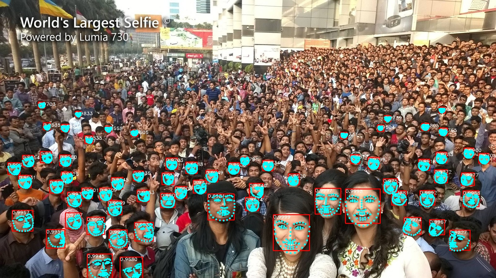
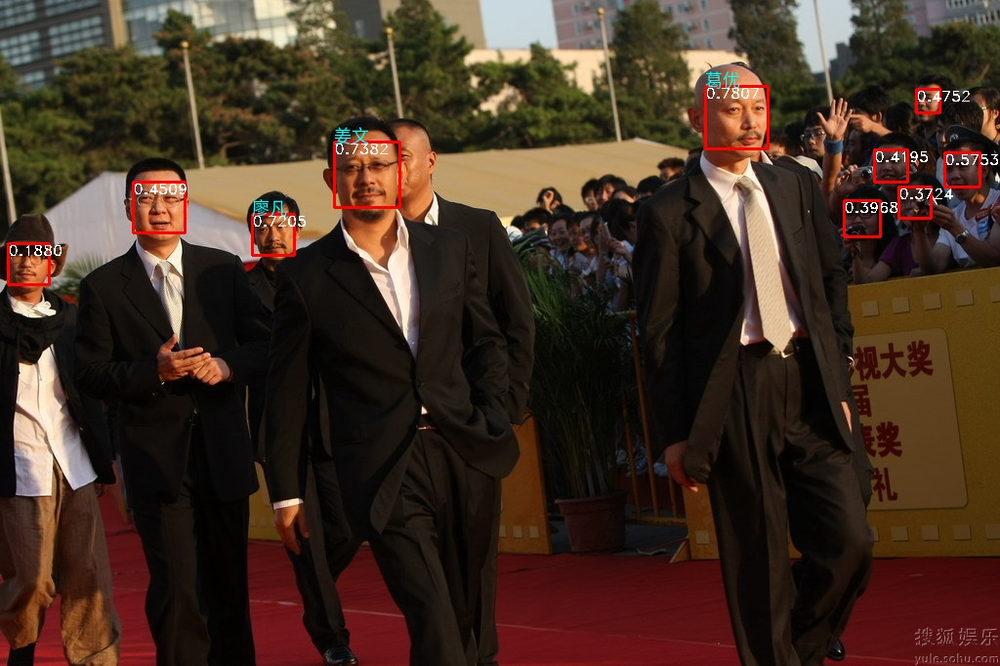

[English](README.md) | 中文
# OpenIVA

 

  

OpenIVA 是一个端到端的基于多推理后端的智能视频分析开发套件，旨在帮助个人用户和初创企业快速启动自己的视频AI服务。  
OpenIVA实现了各种主流的面部识别、目标检测、分割和关键点检测算法。并且提供了高效的轻量级服务部署框架，采用模块化设计，用户只需要替换用于自己任务的算法模型。
# 特色
1. 常用主流算法
- 提供最新的主流预训练模型，用于面部识别、目标检测、分割和关键点检测等任务
2. 多推理后端
- 支持 TensorlayerX/ TensorRT/ onnxruntime
3. 高性能表现
- 在 CPU/GPU/Ascend 等硬件平台取得高性能表现, 实现3000it/s以上的推理速度
4. 异步 & 多线程
- 在推理和预/后处理过程中使用多线程和队列以达到高设备占用率
5. 轻量级服务
- 使用Flask来搭建轻量级智能应用服务
6. 模块化设计
- 你只需要替换AI模型就可以快速启动自己的智能分析服务
7. 图形界面的可视化工具
- 只需要点击几个按钮就可以启动分析任务， 并且可以在GUI窗口里展示可视化的结果，适合多种任务

# 性能基准
## 测试环境 
- i5-10400 6c12t
- RTX3060  
- Ubuntu18.04
- CUDA11.1
- TensorRT-7.2.3.4
- onnxruntime with EPs:
  - CPU(Default)
  - CUDA(Compiled)
  - OpenVINO(Compiled)
  - TensorRT(Compiled)

## 性能表现
### 人脸识别
运行  
`python test_landmark.py`  
`batchsize=8`, `top_k=68`, 图片中有67张人脸 
- Face detection  
  Model `face_detector_640_dy_sim`
  |onnxruntime EPs| FPS | faces per sec|
  |  ----  | ----  | ----  |
  | CPU | 32 | 2075 |
  | OpenVINO | 81 | 5374 |
  | CUDA | 105 | 7074 |
  | TensorRT(FP32) | 124 | 7948 |
  | TensorRT(FP16) | 128 | 8527 |

- Face landmark   
  Model `landmarks_68_pfld_dy_sim`
  |onnxruntime EPs |  faces per sec|
  |  ----  | ----  |
  | CPU | 69 |
  | OpenVINO | 890 |
  | CUDA | 2061 |
  | TensorRT(FP32) | 2639 |
  | TensorRT(FP16) | 3131 |

运行  
`python test_face.py`  
`batchsize=8`  
- Face embedding   
  Model `arc_mbv2_ccrop_sim`

  |onnxruntime EPs |  faces per sec|
  |  ----  | ----  |
  | CPU | 212 |
  | OpenVINO | 865 |
  | CUDA | 1790 |
  | TensorRT(FP32) | 2132 |
  | TensorRT(FP16) | 2812 |

### 物体检测
运行  
`python test_yolo.py`  
`batchsize=8`  , 图片中有4件物体 
- YOLOX objects detect  
  Model `yolox_s(ms_coco)`
  |onnxruntime EPs| FPS | Objects per sec|
  |  ----  | ----  | ----  |
  | CPU | 9.3 | 37.2 |
  | OpenVINO | 13 | 52 |
  | CUDA | 77 | 307 |
  | TensorRT(FP32) | 95 | 380 |
  | TensorRT(FP16) | 128 | 512 |

  Model `yolox_m(ms_coco)`
  |onnxruntime EPs| FPS | Objects per sec|
  |  ----  | ----  | ----  |
  | CPU | 4 | 16 |
  | OpenVINO | 5.5 | 22 |
  | CUDA | 46.8 | 187 |
  | TensorRT(FP32) | 64 | 259 |
  | TensorRT(FP16) | 119 | 478 | 

  Model `yolox_nano(ms_coco)`
  |onnxruntime EPs| FPS | Objects per sec|
  |  ----  | ----  | ----  |
  | CPU | 47 | 188 |
  | OpenVINO | 80 | 320 |
  | CUDA | 210 | 842 |
  | TensorRT(FP32) | 244 | 977 |
  | TensorRT(FP16) | 269 | 1079 |

  Model `yolox_tiny(ms_coco)`
  |onnxruntime EPs| FPS | Objects per sec|
  |  ----  | ----  | ----  |
  | CPU | 33 | 133 |
  | OpenVINO | 43 | 175 |
  | CUDA | 209 | 839 |
  | TensorRT(FP32) | 248 | 995 |
  | TensorRT(FP16) | 327 | 1310 |

# 进度  
- [ ] 多推理后端
    - [x] onnxruntime
        - [x] CPU
        - [x] CUDA
        - [x] TensorRT
        - [x] OpenVINO
    - [ ] TensorlayerX
    - [ ] TensorRT
- [ ] 异步 & 多线程
    - [x] prototype

- [ ] 轻量级服务
    - [x] prototype

- [ ] 图形界面的可视化工具

- [ ] 常用主流算法
    - [x] Face detection

    - [x] Face landmark

    - [x] Face embedding
        - [ ] prototype
    
    - [ ] Object detection
      - [ ] YOLOX
    - [ ] Semantic/Instance segmentation

    - [ ] Scene classification
        - [x] prototype

